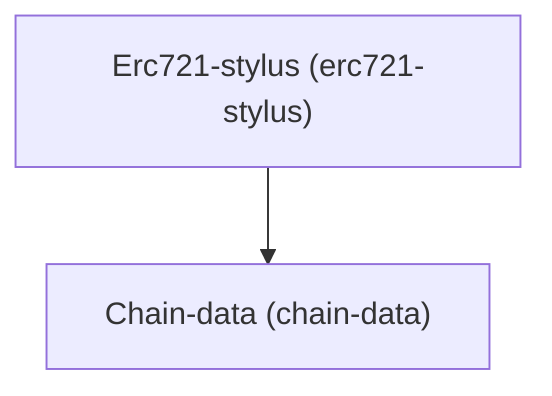

# Architecture

## Dependency Graph

```mermaid
graph TD
  ac4e3cdc["Erc721-stylus (erc721-stylus)"]
  63058cff["Chain-data (chain-data)"]
  ac4e3cdc --> 63058cff
```

## Execution / Implementation Order

1. **Erc721-stylus** (`ac4e3cdc`)
2. **Chain-data** (`63058cff`)
